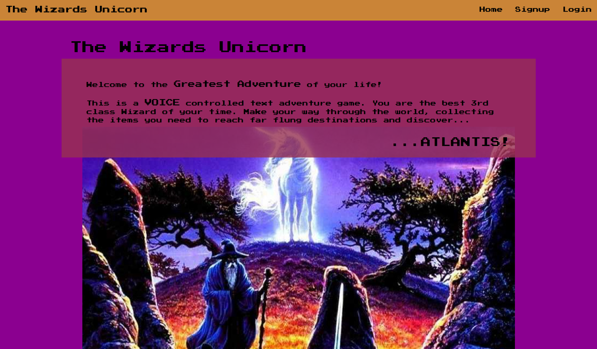
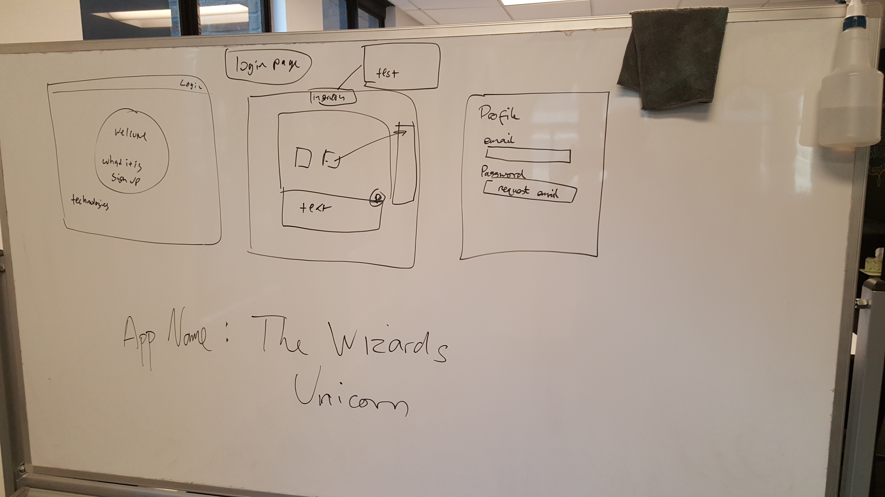
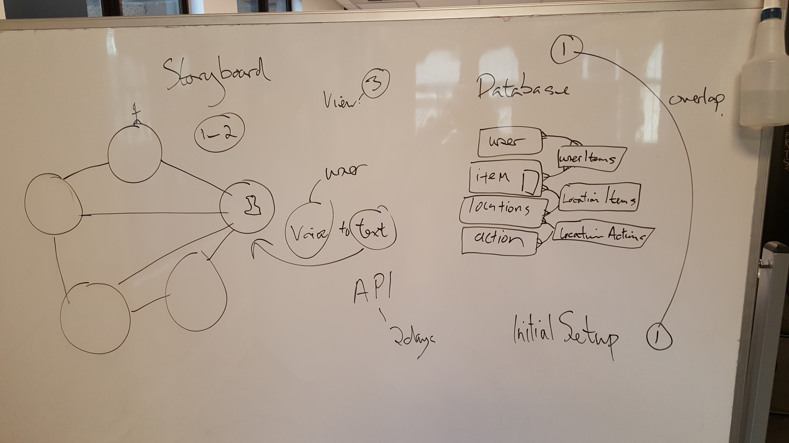
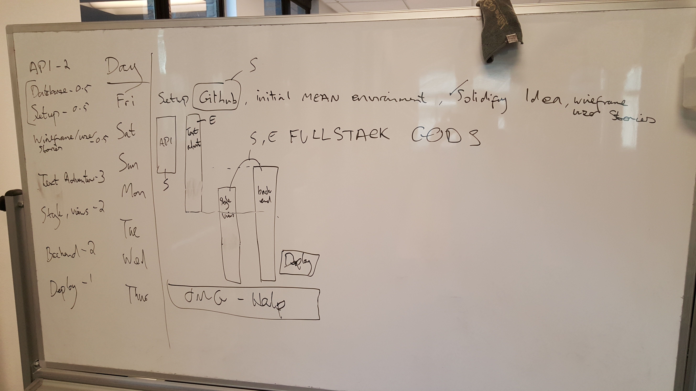

# The Wizards Unicorn
This is a voice controlled text adventure game written using the MEAN stack. Angular, Node.js, Express and MongoDB. The API is Microsoft's Voice to Text API released during BUILD 2016. The user is able to control the game simply by talking commands and the game acts upon those commands.

### Screenshots

### Features
* Voice control.
* Text Adventure.
* The user can sign in to access their game.
* The game state is held on MongoDB so it's accessable every time the user logs in.

### User Stories
* As a user, I want to go to the homepage and quickly see what the site is about and why I need to use it.
* As a user, I want to know that if I use this app, it will be easy and quick to understand and use, and why this app is better than the other ones out there.
* As a user, I want to be able to create a new game and reset it.
* As a user, I want to be able to return to my game at a later time and have the state be remembered.
* As a user, I'd like to be able to easily navigate the entire site.
* As a user, I'd like to be able to sign up through the site.

### Wire Frames

### ERD

### Credits
* [Angular](https://angularjs.org/)
* [Node](https://nodejs.org/en/)
* [Express](http://expressjs.com/)
* [Mongo](https://www.mongodb.org/)
* [Google Web Fonts - Press Start 2P](http://google.com/fonts)
* [BootStrap](https://netdna.bootstrapcdn.com)
* [Microsoft](https://www.microsoft.com/cognitive-services/)
* [Parallax](https://github.com/wagerfield/parallax)
* [Font Awesome Icons](https://fortawesome.github.io/Font-Awesome/icons/)

### Known Issues
* none

### Disclaimer
The Wizards Unicorn is an original app from [Scott Heron](https://github.com/scottheron/) and [Ethan Young](https://github.com/younge2).
